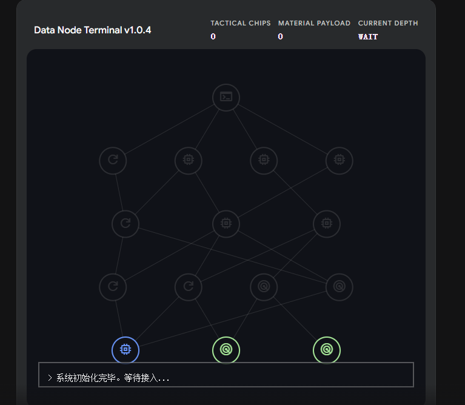
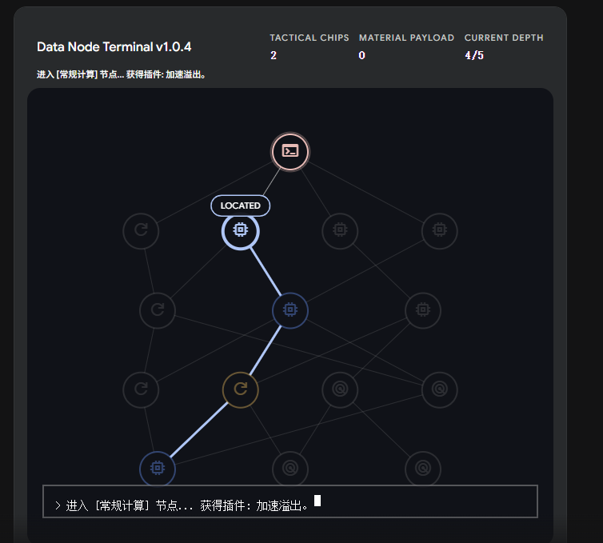

# AlgoMon — Algorithmic Monster Roguelite

> **A data-driven PVE Roguelite built on real Computer Science.**  
> Navigate procedural node networks, capture algorithmic creatures, and optimize their hardware limits through genetic merging — all powered by the data structures you know from class.

**Engine:** Unity 2022.3 LTS &nbsp;|&nbsp; **Language:** C# &nbsp;|&nbsp; **Genre:** Roguelite / Tactical Simulator  
**Status:** `Pre-production — System Prototyping Complete`

**Related coursework:** In-class activity projects have been moved to
[Game-programming--Inclass-Activities](https://github.com/JiachiZhu/Game-programming--Inclass-Activities)
so this repository can stay focused on AlgoMon.

---

## 🧬 Concept

AlgoMon rejects the traditional fantasy dungeon aesthetic. Instead, the player is a **cyber-hacker** operating inside a data network, capturing and reprogramming **algorithmic creatures** — beings whose stats, abilities, and genetic makeup are pure data structures. Player will constantly engage in attacks, fixes, and management of the network (that is, constantly interacting with various bug algomons), incorporate them into one's own use, gradually become stronger, and eventually become the strongest hacker in the entire DIICSU.

Every mechanic in this game is a direct expression of a computer science concept. The algorithms are not hidden in the engine; they *are* the gameplay.

---

## ⚙️ Core Systems & Algorithm Index

### 1. The Grid — Procedural Node Network
The exploration layer is a pure UI route-selection graph, with no walking or real-time movement.

| Component | Algorithm / Pattern | Complexity |
|---|---|---|
| Map generation | **Directed Acyclic Graph (DAG)** with layered topology | O(V + E) |
| Path connectivity | Topological sort + reachability validation | O(V + E) |
| State separation | Tactical Chips (session) vs. Payload (persistent) | — |

A DAG guarantees the player always has a valid route to the Boss node, while preventing graph-level backward loops that would break roguelite progression. Reboot nodes are a controlled exception in run state only: from a Reboot node, the player may either continue forward or return the route cursor to Start while preserving visited nodes.

| Node Type | Icon Role | Gameplay Meaning |
|---|---|---|
| Start | Terminal | Entry point into the run network. |
| Combat | Sword | Standard battle encounter. |
| Elite | Sword | Harder battle encounter. |
| Shop | CPU | Trading node; separate from Reboot/reset logic. |
| Reboot | Refresh | Route-control node that offers an optional return to Start without clearing visited nodes. |
| Boss | Double swords | Final run encounter. |

Each battle encounter starts its combatants at full Battery and their configured starting CP. The Grid does not use attrition/rest-stop pacing; route choices are meant to shape encounter order and options, not punish players for conserving resources between fights.

### 2. The Arena — Priority-Based Combat Engine
A 2D side-view tactical battle system. Skills are packaged as executable data instructions, not magic spells.

| Component | Algorithm / Pattern | Complexity |
|---|---|---|
| Turn ordering | **Max-Heap Priority Queue** keyed on Clock Speed; skill priority tier (+1 first-strike > 0 normal > -1 last-strike) overrides Clock Speed | O(log N) per insert/extract |
| ASD counter system | Per-skill opt-in RPS triangle (A>S>D>A); only skills with `canCounter=true` trigger the check | O(1) |
| Element type chart | **6×6 static matrix** lookup (Water/Fire/Grass/Ice/Electric/Ground) | O(1) |
| Skill damage model | raw = rawAttack x (basePower/100) x elementMult x counterMult; damage = Floor(raw x 50 / (50 + defence)) | O(1) |
| Buff/Debuff system | **Observer Pattern (Event Bus)** — fully decoupled | O(1) dispatch |
| Dual resource model | Battery (HP) + Computing Power (CP) constraints | — |

Turn priority resolves in three tiers: **ASD counter winner** (highest) -> **skill priority** (+1 first-strike > 0 normal > -1 last-strike) -> **Clock Speed** tiebreak.

Both players simultaneously choose Attack / Status / Defense and declare a skill. The **ASD check only fires when the acting skill has `canCounter = true`** and its instruction type wins the matchup (A>S, S>D, D>A). Skills without `canCounter` resolve purely by speed and priority — no RPS, no interruption.

When a counter succeeds, the effect depends on the winning skill's `counterSuccessType`:

| counterSuccessType | What happens to the LOSER |
|---|---|
| **None** | Delayed via ForceAfter; skill still executes, CP consumed |
| **Nullify** | Skill fully cancelled; CP **not** consumed, turn wasted |
| **Block** | Attack still fires but damage reduced by `counterBlockPercent` |
| **SelfBuff** | Loser unaffected; winner gains extra buff stacks on top of base effect |

All Defense skills have `canCounter = true` by design. Defense skills also have a **1-turn cooldown** after use to prevent passive looping.

#### Computing Power (CP) — Resource System

Every skill costs CP to execute. Each AlgoMon has a shared CP pool with a hard cap of **10 CP**.

| CP Cost | Skill tier | Risk profile |
|---|---|---|
| 1 – 2 | Priority / light attack | Low risk, low payoff |
| 3 – 4 | Standard attack | Core combat budget |
| 5 – 6 | Heavy attack | High payoff, high risk |

**Recharge** is a built-in Status (S) skill available to every AlgoMon: 0 CP cost, restores 5 CP in one turn. Recharge has `canCounter = false` — it does not actively try to counter anything. However, it can BE countered: any opponent Attack skill with `canCounter = true` wins the A > S matchup. If that Attack carries Nullify, the Recharge is cancelled and the turn is wasted (CP not consumed). Timing a Recharge is a meaningful commitment embedded in the same RPS mind-game.

CP consequences when countered depend on which side loses:

| Scenario | CP outcome for the loser |
|---|---|
| Attack countered by a Nullify | Attacker's skill cancelled, **CP not consumed** |
| Defense countered by a Status | Obtain additional status effects，Defence keep, **CP consumed** |
| Attack blocked by a Defense (Block) | Attack fires at reduced damage, **CP consumed** |

#### AlgoMon Stat Design — Six Dimensions

Each AlgoMon has six base stats that map directly to classic RPG archetypes, re-skinned as hardware specifications:

| Stat | RPG Equivalent | Role in Combat |
|---|---|---|
| **Battery** | HP | Reaches zero → unit is shut down |
| **Clock Speed** | Speed | Key for the Priority Queue — higher clock acts first |
| **Computing Power** | Physical Attack | Damage output via A-type (Attack) instructions |
| **Throughput** | Magic Attack | Damage output via S-type (Special) instructions |
| **Firewall** | Physical Defence | Damage reduction against Computing Power attacks |
| **Encryption** | Magic Defence | Damage reduction against Throughput attacks |

The dual-damage-route design creates a meaningful strategic layer: if the opponent's Firewall is high, swap to a high-Throughput AlgoMon to exploit their Encryption instead — and vice versa. This mirrors the physical/magical split found in classic monster-battler games, grounded here in networking and hardware terminology.

### 3. The Terminal — Gene Lab & Payload Vault
The meta-progression layer, styled as a backend admin dashboard.

| Component | Algorithm / Pattern | Complexity |
|---|---|---|
| IV inheritance (gene merge) | **Greedy Algorithm** — `IV_child = Math.Max(IV_A, IV_B)` per stat | O(S) where S = stat dimensions |
| Payload sorting & search | **QuickSort** with multi-key comparator | O(N log N) average |
| Stat model | Hard-cap IV (hardware) / soft-cap EXP (software) separation | — |

The IV/EXP split is the game's core design pillar: grinding only raises software progress. To break the hardware ceiling, players must invest in genetic merging — a deliberate resource sink.

#### Payload vs. Party — Two-Tier Roster System

`Party` is the internal code name for the player's active run squad.

| | Payload (Warehouse) | Squad / Party (Active Run Team) |
|---|---|---|
| **What it is** | Every AlgoMon the player has ever captured | The squad selected for the current run |
| **Size limit** | Unlimited | Max 4 |
| **Where managed** | The Lab — sorted via QuickSort | Pre-run selection screen |
| **Algorithmic focus** | O(N log N) retrieval and sorting | — |

This separation means the player must make deliberate squad-building decisions before each run — they cannot bring everything.

---

## 🗺️ UI Prototypes

Detailed UI wireframes and interaction flows are archived in the [`/Prototype`](./Prototype/) directory.

| Screen | Preview |
|---|---|
| Main Terminal Dashboard |  |
| The Grid — Initial State |  |
| The Grid — Active Pathing |  |
| The Arena — Battle View |  |
| Payload Vault — Data Matrix |  |

---

## 📂 Project Structure

```
AlgoMon-Loop/
├── Assets/_AlgoMon/
│   ├── Scripts/
│   │   ├── Core/          # EventBus, GameManager, StateMachine
│   │   ├── Data/          # ScriptableObjects — AlgoMonSO, SkillSO
│   │   ├── Grid/          # DAGGenerator, NodeGraph, PathValidator
│   │   ├── Battle/        # PriorityQueue, CombatResolver, ASDMatrix
│   │   ├── Lab/           # GeneticMerger, PayloadSorter (QuickSort)
│   │   └── UI/            # Controllers for Terminal, Grid, Arena, Lab
│   ├── Scenes/
│   │   ├── MainTerminal.unity
│   │   ├── TheGrid.unity
│   │   ├── TheArena.unity
│   │   └── TheLab.unity
│   └── ScriptableObjects/
├── Prototype/             # UI wireframes & design archive
└── README.md
```

---

## 🚀 Getting Started

1. Clone the repository
2. Open in **Unity Hub** with Unity **2022.3 LTS**
3. Open scene `Assets/_AlgoMon/Scenes/MainTerminal.unity`
4. Press Play

---

## 👥 Team

| Role | Contributor |
|---|---|
| Design & Engineering | Jiachi Zhu |

---

## 🎨 Credits

| Asset | Tool | Notes |
|---|---|---|
| AlgoMon sprite artwork (12 images) | Google Gemini 3.1 Pro (image generation) | All portraits generated specifically for this project |
| Development Guidelines | [Karpathy Cursor Rules](https://github.com/forrestchang/andrej-karpathy-skills/blob/main/.cursor/rules/karpathy-guidelines.mdc) | Used to configure Cursor IDE to maintain code quality and avoid AI generation pitfalls |
